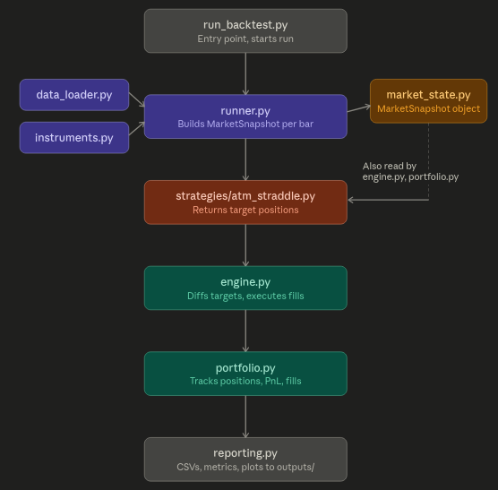

# Backtest Engine

A backtest engine for the NIFTY/BANKNIFTY ATM straddle assignment:
buy the CE+PE closest to the futures price, in the nearest expiry,
1-second resolution, hold until the ATM strike changes, flatten at
day end, across NIFTY and BANKNIFTY, across multiple days.

The engine is written to be strategy-agnostic. The strategy's
rules (nearest expiry, ATM selection, max 1 lot, day-end flatten) are
all implemented in `strategies/atm_straddle.py`.

## Setup

```bash
python3 -m venv .venv

source .venv/bin/activate

python -m pip install -U pip
```

```bash
python -m pip install pandas numpy matplotlib
```

## Running

```bash
# Real data
python run_backtest.py --root /path/to/allData

# Specific subset of dates
python run_backtest.py --root /path/to/allData --dates 20221101,20221102
```


Every run writes to `--out` (default `./outputs/`):

| File | Contents |
|---|---|
| `mtm_history_*.csv` | Timestamp, realized PnL, unrealized PnL, total PnL, open-position count - one row per second |
| `fills_*.csv` | Every individual trade: timestamp, symbol, signed qty, price |
| `trade_log_*.csv` | One row per completed holding period: symbol, entry/exit time, qty, entry/exit price, realized PnL, holding duration - "which instrument was held, from when to when" |
| `daily_pnl_*.csv` | One row per trading day: that day's PnL, running total |
| `pnl_*.png` | Cumulative total/realized/unrealized PnL over time, plus open-position count |
| `drawdown_*.png` | Drawdown from the running peak PnL, over time |
| `daily_pnl_*.png` | Bar chart of PnL per trading day |
| `positions_timeline_*.png` | Gantt-style chart of which instrument was held, when (capped to the most-traded instruments if a run touches a lot of distinct strikes) |

Printed to stdout at the end of every run: `final_pnl`, `max_pnl`,
`max_drawdown`, `n_fills`, `n_distinct_instruments_traded`,
`n_trading_days`, `n_round_trip_trades`, `total_traded_notional`,
`win_rate`, `avg_trade_pnl`, `avg_holding_seconds`, `avg_daily_pnl`,
`best_day_pnl`, `worst_day_pnl`.

## Code structure

```
instruments.py         instrument identity: filename -> (underlier, expiry, strike, type)
data_loader.py          file discovery + raw tick loading + 1s resampling (no strategy knowledge)
market_state.py         MarketSnapshot - the one object a strategy is allowed to see
strategy.py              the Strategy Protocol (structural contract) + StrategyT TypeVar
strategies/
  selection_utils.py      strike/expiry selection helpers (ATM pairing, nearest expiry)
  atm_straddle.py          the provided strategy
engine.py                ReconciliationEngine: diffs target positions vs current, emits trades
portfolio.py              positions, fills, realized/unrealized PnL (strategy-agnostic)
runner.py                 builds the 1s snapshot stream per date, drives the engine
reporting.py              DataFrames, summary stats, plots (strategy-agnostic)
run_backtest.py           entry point: wires strategy + engine + runner + reporting together
```

### Architecture



## Design principles

### Separation of concerns, enforced by what each module is allowed to import

Each layer only knows about the layer(s) below it, and nothing about
what's above:

- **`instruments.py` / `data_loader.py`** know about file formats and
  raw ticks. They know nothing about strategies, "ATM", or expiry
  rules - `DateUniverse` exposes *every* contract discovered for a
  date, unfiltered. Swapping the storage backend only touches this layer.
- **`market_state.py`** (`MarketSnapshot`) is pure data: futures
  prices, option prices/OI/volume, and which contracts are in scope
  today. 
- **`strategies/`** turns a `MarketSnapshot` into desired positions.
  A strategy never touches the portfolio, never places an order, never
  sees a fill or a PnL number - it's a pure function of
  `(snapshot, current_positions) -> {symbol: target_qty}`. That
  purity is what lets one `ReconciliationEngine` serve any strategy
  with the same code.
- **`engine.py`** only knows the Strategy Protocol and the Portfolio
  interface. Its entire job is: ask the strategy what it wants, diff
  that against what's currently held, execute the difference. It has
  no NIFTY/BANKNIFTY/option-specific logic anywhere in it.
- **`portfolio.py`** only knows symbols, signed quantities, prices,
  and timestamps - it has no idea what an option or a straddle is.
- **`reporting.py`** only reads `Portfolio.fills` /
  `Portfolio.mtm_history`, so its output is identical regardless of
  which strategy produced them.

### What's strategy-owned vs. engine/data-owned 

A few things read as generic backtest machinery but are actually
strategy-specific policy, and are modelled as such rather than baked
into the engine:

| Concern | Lives in | Why |
|---|---|---|
| Day-end square-off | `strategy.get_target_positions(..., force_flat=True)` | There's no `close_all` in the engine. End-of-session is just one more reconciliation step, flagged; the strategy decides what "flat" means for it (a hard flatten just returns `{}`, and the engine's ordinary diff logic sells out whatever's open). |
| Max position size | `strategy.max_abs_position` | Different strategies want different risk limits; the engine only clamps to whatever the strategy declares. |
| ATM strike pairing | `strategies/selection_utils.py: find_atm_pair` | Not a method on `MarketSnapshot` - a different strategy could pick strikes by delta, by OTM offset, or not use an ATM concept at all. |
| Which expiry is tradable | `strategy.select_tradable` (delegates to `nearest_expiry_options`) | "Nearest expiry" is this assignment's rule, not a fact about the raw data; `DateUniverse` just discovers files with no expiry filtering baked in. |
| Session end time | `runner._session_index` | Derived per-date as `max(15:30, latest tick seen that date)`, rather than a hardcoded constant that would silently clip a day that runs later. |

### The Strategy pattern used here is static, not the classic GoF one

Classic (dynamic) Strategy: an abstract base class with a virtual
method; a `Context` holds a `Strategy` *reference*, concrete
strategies are swapped in at runtime, and the call is dispatched
through the class's vtable/MRO every time, with correctness enforced
by `isinstance` at runtime.

This codebase defines `Strategy` as a `typing.Protocol`
(`strategy.py`) instead - a *structural* type. `ATMStraddleStrategy`
doesn't inherit from anything; it satisfies the contract purely by
having a matching `name`/`max_abs_position`/`select_tradable`/
`get_target_positions` shape. `ReconciliationEngine` is
`Generic[StrategyT]`, so `ReconciliationEngine[ATMStraddleStrategy]`
is, conceptually, a distinct specialization for that one strategy type
- closer to a C++ template instantiation than a runtime interface
check ("policy-based design"). Running `mypy --strict` over the
package is how a strategy with a mismatched signature gets rejected -
at type-check time, before any backtest runs - rather than via a
runtime `isinstance` check or an `AttributeError` mid-run.

The tradeoff, and why it's the right one here: you don't get
runtime strategy-swapping for free. That's fine - a backtest run
picks one strategy at construction time and runs it; there's no
requirement to swap strategies mid-run. What you get instead is zero
coupling to a base class (a strategy can be a plain class, dataclass,
or even a module of functions, as long as the shape matches) and full
static type safety of the engine<->strategy contract.

## Key properties

- **Modularity.** Each layer (data / market state / strategy / engine
  / portfolio / reporting) is independently replaceable: a different
  data source only touches `data_loader.py`; a different strike/expiry
  rule only touches `strategies/`; a different fill/PnL accounting
  scheme only touches `portfolio.py`. None of the other layers need to
  change or even know a change happened.
- **Extensibility.** Adding a second strategy is writing one new class
  that matches the `Strategy` Protocol - no changes anywhere else.
  The engine's reconciliation loop (`set(current) | set(target)`,
  diff, execute) makes no assumption about how many instruments a
  strategy holds at once, whether quantities are all-positive, or
  which expiry/underlier a symbol belongs to, so strategies far
  outside "buy an ATM straddle" (baskets of more than two legs,
  long+short combinations, multiple underliers in one strategy,
  signals derived from OI/volume rather than price) plug in the same
  way, with no engine changes - `MarketSnapshot` already exposes
  price, OI, and volume per instrument for exactly this reason, even
  though the provided strategy only reads price.
- **Performance at real scale.** A day's backtest only loads and
  resamples the option files the strategy's own `select_tradable`
  says are in scope (not every file discovered that day), per-tick
  snapshot construction is vectorized (numpy arrays + masking, not a
  pandas label lookup per symbol per tick), and the strike-chain
  lookups in `selection_utils.py` are memoized per date instead of
  rebuilt on every one-second tick. None of this changes what gets
  computed, only how fast.

## Implementation detail:
End-of-day square-off: Remaining positions are force-closed after the final available market snapshot of each trading day. The closing trades use a synthetic timestamp immediately following the last processed snapshot, indicating an internal bookkeeping event rather than a market-data timestamp.

## Metrics

atm_straddle_buyer 
- final_pnl: -2158.2999999999925
- max_pnl: 37.949999999999264
- max_drawdown: -2213.199999999991
- n_fills: 32688
- n_distinct_instruments_traded: 148
- n_trading_days: 21
- n_round_trip_trades: 16344
- total_traded_notional: 4930147.100000001
- win_rate: 0.46426823299069997
- avg_trade_pnl: -0.13205457660303482
- avg_holding_seconds: 115.63870533529123
- avg_daily_pnl: -102.77619047619012
- best_day_pnl: 66.94999999999965
- worst_day_pnl: -337.8500000000003
